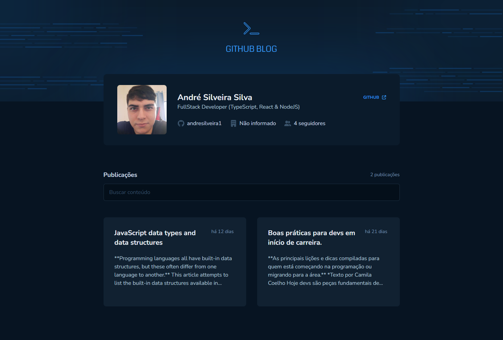

<h1 align="center">Github Blog</h1>



<br>

## Introduction

#### Project build with Vite, ReactJS and Typescript.

<p>The Github API was used to supply this application with data from a user and issues from a specific repository.</p>

<p>You can Search a Issue and check the full content.</p>

## Routes

#### Text is any word that a Issue have in common.
#### Number: each Issue return a number and this will be used to access the Issue.

```http
  /users/username

  /search/issues/text repo:username/repositoryName

  /repos/username/repositoryName/issues/number
```

## Some library that has used on develop.

- Axios.
- React Hook Form.
- React markdown.
- Tailwindcss.
- Tailwindcss/typography.

<br>

[](https://choosealicense.com/licenses/mit/)
